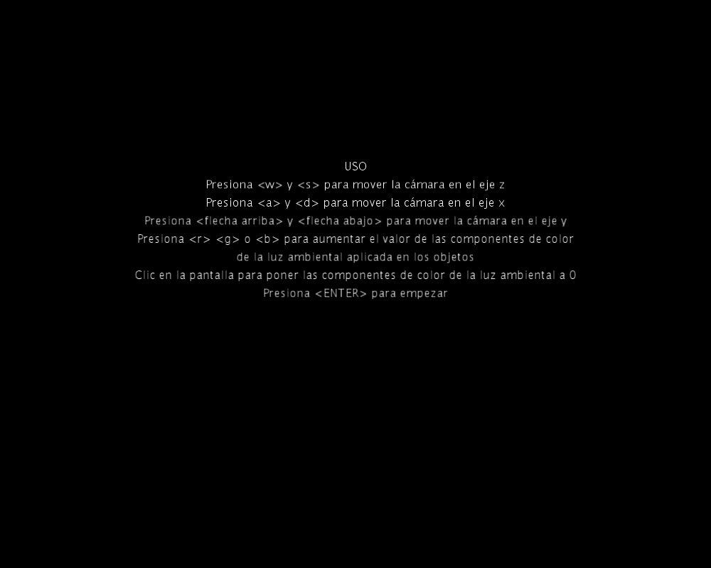

# CIU_P5

## Autor
Francisco Jose Santana Sosa

## Descripción
En esta práctica se ha representado una escena libre, para ello se ha hecho uso de todo lo aprendido en las anteriores prácticas 
y los nuevos conceptos introducidos en esta, sobre todo los aspectos relativos a iluminación.

Entre las características de la aplicación encontramos el uso de la cámara que nos permitirá movernos por la escena, el uso de
primitivas 3D para la creación de esferas, cubos y formas personalizadas para crear las paredes de la escena. Con respecto a la 
iluminación se intenta aplicar diferentes iluminaciones a los distintos elementos de la escena, por ejemplo a las paredes se le 
aplica una luz direccional desde distintas direcciones y con distintos componentes de color, a los objetos de la escena se le 
aplica una iluminación usando pointLight() que varía dependiendo de la posición de la cámara y por último a estos también se le 
aplica una luz ambiental la cual se le permite al usuario cambiar las componentes de color.

## Referencias
Guión de prácticas

## Muestra de ejecución

